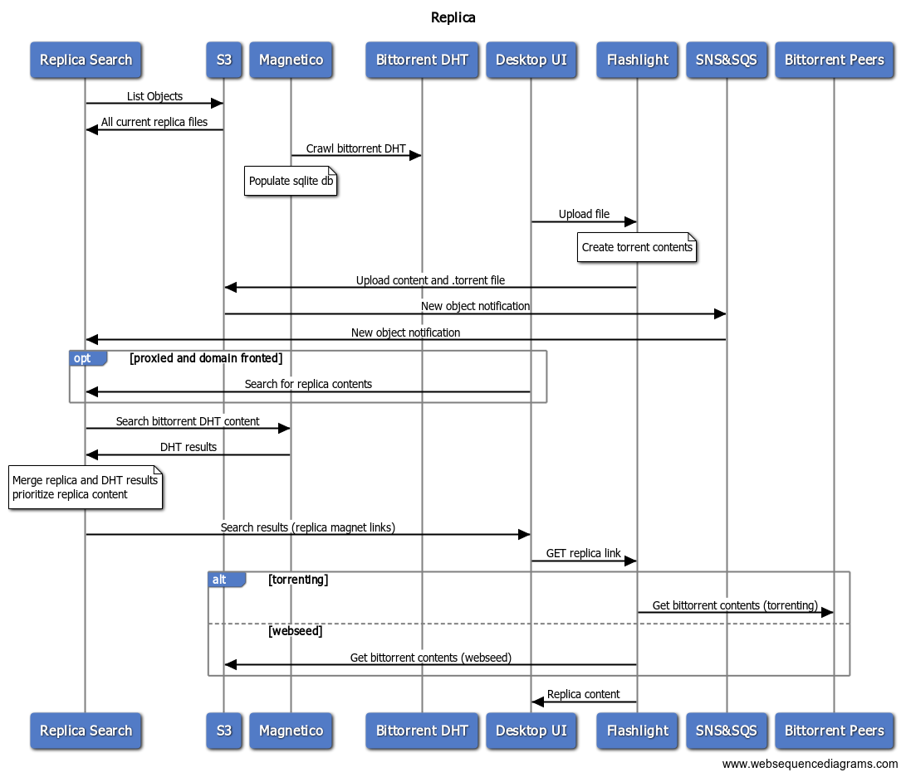

# Replica
Replica is a circumvention resistant p2p content sharing platform.
It leverages the bittorrent protocol to provide distributed data access, while creating an easy to use, centrally organized content index.

## Architecture
Replica currently consists of the following:
- The flashlight client which provides a UI
- An s3 bucket which is our primary centralized data store
- A search server which handles requests from the flashlight client and returns replica content
- Replica peers which act as bittorrent seeders that can run inside censored countries as bootstrapping nodes
- An AWS lambda which can download videos from youtube and other content providers and add them to replica
Replica content is directly uploaded to S3 from flashlight clients along with a `.torrent` file, which contains torrent information

### Flashlight
The flashlight client runs a bittorrent client provided by [anacrolix/torrent](https://github.com/anacrolix/torrent) and [anacrolix/confluence](github.com/anacrolix/confluence).
Search results are provided by replica-search in the form of magnet links, which the flashlight client understands.
The desktop web ui downloads (and streams) content from the flashlight localhost server.
The flashlight localhost server uses `anacrolix/torrent` to provide either a cached on-disk response or a bittorrent chunked data response.
In addition to traditional torrenting, `anacrolix/torrent` also supports a [webseed](https://www.bittorrent.org/beps/bep_0019.html) implementation which allows clients to download chunks directly from s3.
All work is currently being done on the [replica](https://github.com/getlantern/flashlight/tree/replica) branch. For the desktop client, my understanding is that generally work is being done on the [bcm/integrated-ui](https://github.com/getlantern/lantern-desktop-ui/tree/bcm/integrated-ui) branch

### Replica Search
[Replica search](https://github.com/getlantern/replica-search) is a rust web service running on [heroku](https://dashboard.heroku.com/apps/replica-search).
It uses AWS S3 `ListObjects` and SNS and SQS to listen for S3 `CreateObject` events to populate an in-memory index of replica content which incoming search requests query against.
It also makes upstream search requests to a [magnetico](https://github.com/boramalper/magnetico) server running at https://magneticow.lantern.io. 
Magnetico is a bittorrent [DHT](https://en.wikipedia.org/wiki/Mainline_DHT) crawler which builds up a sqlite database of torrents that can be searched against.
There's _some_ more information about launching magnetico instances here: https://github.com/getlantern/lantern_aws#launching-a-magnetico-host

### Replica Peer
[Replica peer](https://github.com/getlantern/replica-peer) is a go service which can be deployed on VPSs both inside and outside censored countries which can bootstrap bittorrent downloads for replica content.
Essentially, this just provides an additional source for replica downloads and can help bootstrap content availability inside censored countries.
It uses a localhost nginx proxy to cache content which it can download from s3: https://github.com/getlantern/lantern_aws/tree/master/salt/replica_peer which is inspired (copied in part from) https://blog.sentry.io/2017/03/01/dodging-s3-downtime-with-nginx-and-haproxy

### Replica lambdas
At the moment we're experimenting with a single [replica lambda](https://github.com/getlantern/replica-lambdas) that can listen on an SQS queue for youtube (or other media) urls and then download that content and upload it to replica.
It uses a compiled binary from our [replica repo](https://github.com/getlantern/replica) to upload content to S3.
It uses [serverless](https://www.serverless.com/) to manage all the AWS/lambda stuff, which has been pretty easy/straightforward.

### Replica
We have an abstracted golang [replica repo](https://github.com/getlantern/replica) which handles some common tasks including uploading content to S3, forming replica links, calculating info hashes, etc.
It can compile a binary which will currently let you upload replica content (and do a couple other utility actions)

### Web sequence diagram

```
title Replica
Replica Search->S3: List Objects
S3->Replica Search: All current replica files
Magnetico->Bittorrent DHT: Crawl bittorrent DHT
note over Magnetico: Populate sqlite db
Desktop UI->Flashlight: Upload file
note over Flashlight: Create torrent contents 
Flashlight->S3: Upload content and .torrent file
S3->SNS&SQS: New object notification
SNS&SQS->Replica Search: New object notification
opt proxied and domain fronted
    Desktop UI->Replica Search: Search for replica contents
end
Replica Search->Magnetico: Search bittorrent DHT content
Magnetico->Replica Search: DHT results
note over Replica Search
    Merge replica and DHT results 
    prioritize replica content
end note
Replica Search->Desktop UI: Search results (replica magnet links)
Desktop UI->Flashlight: GET replica link
alt torrenting
    Flashlight->Bittorrent Peers: Get bittorrent contents (torrenting)
else webseed
    Flashlight->S3: Get bittorrent contents (webseed)
end
Flashlight->Desktop UI: Replica content
```
